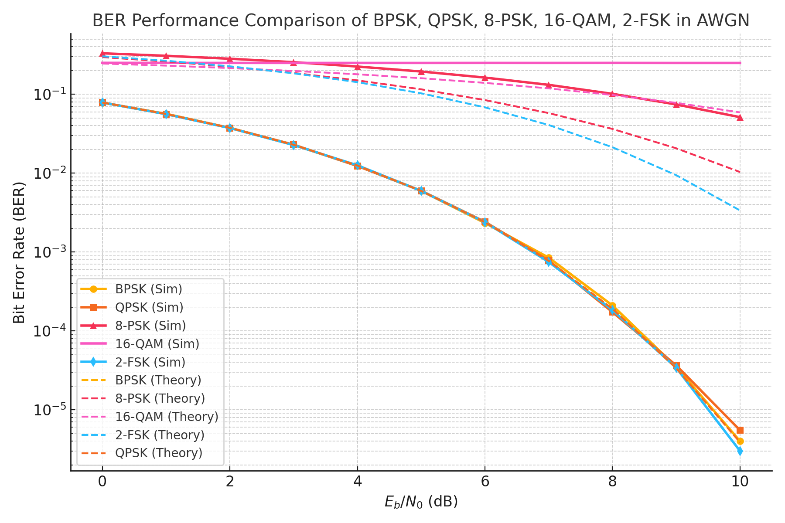

# BER Simulation of Digital Modulation Schemes

This repository contains MATLAB codes and supporting files for the comparative bit error rate (BER) analysis of five popular digital modulation schemes: **BPSK, QPSK, 8-PSK, 16-QAM, and 2-FSK** over an Additive White Gaussian Noise (AWGN) channel.

## Overview

The code provided in this repository performs both theoretical and simulation-based BER analysis for each modulation scheme, allowing for a clear comparison of their error performance under identical channel conditions.  
The results can be used for academic studies, communication engineering courses, and research on digital communications.

## Modulation Schemes Covered

- **BPSK** (Binary Phase Shift Keying)
- **QPSK** (Quadrature Phase Shift Keying)
- **8-PSK** (8-Phase Shift Keying)
- **16-QAM** (16-level Quadrature Amplitude Modulation)
- **2-FSK** (Binary Frequency Shift Keying)

## Features

- Theoretical BER curves based on analytical formulas for each modulation
- Monte Carlo simulations for empirical BER estimation
- Comparative plot of all schemes on a single figure
- Easily extensible for additional modulations or channel types

## File Structure

- `ber_comparison_modulations.m` — Main MATLAB script for BER computation and plotting
- `README.md` — This documentation file

## Usage

1. Clone or download this repository to your local machine.
2. Open the `ber_comparison_modulations.m` script in MATLAB.
3. Run the script. It will simulate and plot BER curves for all five modulation schemes.

**Note:**  
The script is self-contained and does not require any additional toolboxes except for standard MATLAB functions.

## Example Output

The script generates a figure similar to the following:

## Citation

If you use or adapt this code for your work, please cite as:
Furkan Kadir Yılmaz, "BER Simulation Codes for Digital Modulation Schemes", GitHub repository, 2024.

## License

This project is provided for academic and research use only.  
Feel free to fork, modify, and share with attribution.

## Contact

For questions or feedback, contact:  
**Furkan Kadir Yılmaz**  
Yildiz Technical University  
kadir.yilmaz1@std.yildiz.edu.tr
